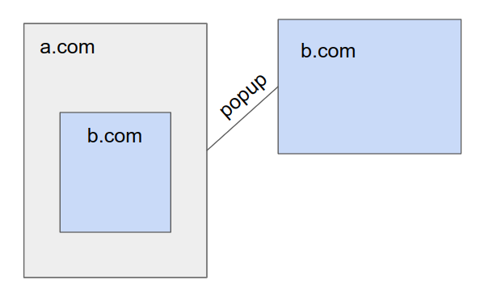

# Cross-Origin-Opener-Policy: restrict-properties

## Terminology
In this explainer, we call _document_ what is rendered by any individual frame. A _page_ contains the top level document, as well as all of its iframe documents, if any. When you open a popup, you get a second page.

## Motivations
We would like websites to improve their performance using SharedArrayBuffers and be able to use cross-origin popup OAuth and payment flows at the same time. This would allow users to benefit from fast websites that support easy to use sign-in and payment flows. This has been asked by websites like Zoom, which want to use SAB for better video conference performance while preserving existing OAuth flows.

SAB, among a couple of other APIs are considered dangerous because they can be used to create high precision timers that enable much easier exploitation of Spectre. For that reason, they should only be used for documents that can be process isolated, and that's what browsers have done, by gating them behind `window.crossOriginIsolated`. This bit is turned to true when COOP is Same-Origin, COEP: `require-corp` or `credentialless`, and for subframes, when their top level document sets the cross-origin-isolated `Permissions-Policy`.

`Cross-Origin-Opener-Policy` (COOP) and `Cross-Origin-Embedder-Policy` (COEP) have now been available for a while, but deployment has been slow and there are still significant pain points for web developers wishing to use these headers. `Permissions-Policy` is easy to deploy, and COEP has been at the core of previous efforts, with `credentialless` being designed explicitly to help with deployment. This document focuses on the difficulties raised by COOP.

Currently, all pages that have legitimate interactions with cross-origin popups and that want to use COOP need to set `COOP: Same-Origin-Allow-Popups` and the popup needs to set `COOP: Unsafe-None`. Cross-origin popups are used for important features like OAuth and payments, that cannot be implemented in a different way. That means any page that uses one of these services cannot use SharedArrayBuffers. It also means that cross-origin service providers cannot set a COOP value to protect themselves against side-channel leaks.

## Changing our approach
It is interesting to get back to the core of what COOP does. It restricts what BrowsingContext can and cannot be in a BrowsingContext group, depending on their top-level origin and COOP value. The initial goal was to be able to put different pages in different processes without breaking scripting invariants, without making assumptions about browser capabilities:

* Synchronous access of DOM requires that the documents live in the same process.
* Asynchronous access of a popup's windowProxy property can be out of process, if the browser supports page isolation. Page isolation is the capability to communicate asynchronously between two pages when they live in two different processes.
* Asynchronous access of an iframe's windowProxy property can be out of process, if the browser supports out-of-process iframes (OOPIF). OOPIF is the capability to communicate asynchronously between an iframe and another document when they live in another process. Note that this has an important impact on memory.

By severing the opener/openee link, it made sure that two pages wouldn't be able to communicate with each other and that they could be put in different processes, regardless of whether we have page isolation or OOPIF. For some use cases however, this does not provide a satisfactory solution.

 

  
_The basic case COOP solves. Without COOP, we have to put all the documents in the same process, because the popup and the iframe are of origin b.com and have synchronous access to each other._

 

In the specification, documents that have synchronous DOM access live in the same AgentCluster. Pages that have asynchronous WindowProxy access live in the same BrowsingContext group. That means all documents in an AgentCluster must live in the same process, and that there is no fundamental reason why a BrowsingContext group should be represented by a single process, it is only an implementation limitation.

In a world where all browsers support OOPIF and page isolation, we can simply put same origin documents within their own process, without having COOP in the first place. Realistically, OOPIF is a complex piece of machinery and is not supported by all browsers and will not be in the near future, but page isolation already is. Both Firefox and Safari support page isolation, and it is a reasonable feature to build upon. The fundamental idea is that if we leverage page isolation we can create a more flexible solution than what exists today using only BrowsingContext groups.

The solution we propose is to add (yet) another COOP value: `restrict-properties`. It says: _"This page will be unable to communicate with other pages apart via postMessage and closed"_ Served together with a suitable COEP policy it would enable `crossOriginIsolated`.

## Technical details of "COOP: restrict-properties"
We're leveraging Page Isolation to transform _"No communication can happen cross page"_ into _"Only limited asynchronous communications can happen cross page"_.

This is not currently possible in the HTML spec because BrowsingContext groups have a simple map of origins to AgentCluster (or domains without isolation, because document.domain still need to be supported). An alternative would be to have multiple maps within a BrowsingContext group, one for all pages that do not use `COOP: restrict-properties`, and an additional one for each isolated page. We would also impose an extra restriction on cross-AgentCluster communication within a BrowsingContext group, only allow postMessage and closed to be accessed.

This would have the following properties:

* Cross-origin popups opened, including all their iframes can only interact with the main page via postMessage and closed.
* Same-origin popups would behave exactly the same. Since they do not share their AgentCluster they would lose DOM access.
* Opener restriction is reversible. If a popup navigates to a `COOP: restrict-properties` page and then navigates again to a `COOP: unsafe-none` page, full access to the opener is possible again.
* 

## Interactions with other COOP values
The COOP algorithm needs to be adapted slightly. We want to consider `COOP: restrict-properties` as `COOP: unsafe-none` regarding BrowsingContext group swaps. `COOP: same-origin-allow-popups` should allow to stay in the same BrowsingContext group when opening a popup to a page with `COOP: restrict-properties`.

Similarly, navigating from `COOP: restrict-properties` to `COOP: same-origin` or `COOP: same-origin-allow-popups` should trigger a BrowsingContext group swap.

## Interactions with COOP reporting
The COOP infrastructure can be used to report access across AgentClusters maps within a BrowsingContext group that would not be postMessage nor closed. As for usual COOP reporting, DOM access will likely not be able to be reported, and only cross-origin available properties other than postMessage or closed will be reported.

This is a fundamental limitation, because reporting synchronous DOM access would require a check on every Javascript access that would have performance impact.

## Security notes
Purposefully chosing the absolute minimum set of windowProxy attributes to make OAuth possible helps prevent side-channel leaks, which has been a concern both for openers and openees.

DOM access is not the only thing that is gated behind same-origin restrictions. We audited the spec to produce a [list](https://docs.google.com/spreadsheets/d/1e6LakHSKTD22XEYfULUJqUZEdLnzynMaZCefUe1zlRc/) of all places with such checks. Some points worthy of attention:

* The location object is quite sensitive and many of its methods/members are same-origin only. It is purposefully excluded from the list of allowed attributes by `restrict-properties`, despite fairly high usage. We do not think we should allow a normal page to navigate a crossOriginIsolated page.
* For similar reasons name targeting does not go across BrowsingContext groups. We should limit it to the current AgentCluster map instead.
* Javascript navigations are a big NO. They mean executing arbitrary javascript within the target frame. There should be no way to navigate a frame from a different AgentCluster map given the restrictions above are put in place.