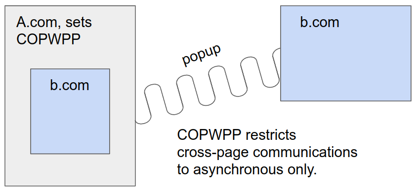

# Cross-Page-Window-Proxy-Policy explainer

## Terminology
In this explainer, we call _document_ what is renderer by any individual frame. A _page_ contains the top level document, as well as all of its iframe documents, if any. When you open a popup, you get a second page.

## Motivations
Cross-Origin-Opener-Policy (COOP) and Cross-Origin-Embedder-Policy (COEP) have now been available for a while and with them the gating of certain powerful APIs like SharedArrayBuffer behind the crossOriginIsolated bit. This bit is turned to true when COOP is Same-Origin, COEP: require-corp or credentialless, and for subframes, when their top level document sets the crossOriginIsolated Permissions-Policy. Deployment has been slow and there are still significant pain points for web developers wishing to use these headers. Permissions-Policy is easy to deploy, and COEP has been at the core of previous efforts, with features like credentialless being designed explicitly to help with deployment. This document focuses on the difficulties raised by COOP in particular.

Maybe it is interesting to get back to the core of what COOP does. It restricts what BrowsingContext can and cannot be in a BrowsingContext group, depending on their top-level origin and COOP value. The initial goal was to be able to put different pages in different processes without breaking scripting invariants. That's important because crossOriginIsolated only applies to entire processes. By severing the opener/openee link, it made sure that two pages wouldn't be able to communicate with each other and that they could be put in different processes. For some use cases however, this does not provide a satisfactory solution.

 

  
_The basic case COOP solves. Without COOP, we have to put all the documents in the same process, because the popup and the iframe are of origin b.com and they have synchronous access to each other._

 

Currently, all pages that have legitimate interactions with cross-origin popups and that want to use COOP need to set COOP: Same-Origin-Allow-Popups. That implies that the main page cannot be crossOriginIsolated, and that the popup must have COOP: Unsafe-None. This is not ideal, as cross-origin popups are used for important features like OAuth and payments, that do not have an alternative. On top of that, popups providing these services would like to also protect themselves against side-channel leaks using COOP.

## Changing our approach
We said above that COOP had to go around some basic scripting invariants. They are:

* Synchronous access of DOM requires that the documents live in the same process.
* Asynchronous access of a popup's windowProxy property can be out of process, if the browser supports page isolation.
* Asynchronous access of an iframe's windowProxy property can be out of process, if the browser supports out-of-process iframes (OOPIF).

In the specification, documents that have synchronous DOM access live in the same AgentCluster. Pages that have asynchronous WindowProxy access live in the same BrowsingContext group. By adding these constructs with the invariants above we get that:

* All documents in an AgentCluster must live in the same process.
* There is no fundamental reason why a BrowsingContext group should be represented by a single process, only implementation limitations.

In a world where all browsers support OOPIF and page isolation, we can simply put same origin documents within their own process, without having COOP in the first place. Realistically, this is not the case for OOPIF, but it is the case for page isolation. Both Firefox and Safari support page isolation, and it is a reasonable thing to expect.

The fundamental idea is that if we leverage page isolation we can create a more flexible solution than what exists today using only BrowsingContext groups.

## Cross-Page-Window-Proxy-Policy as a mean for process isolation
The solution we propose is to add (yet) another header policy, meant for the top level document: Cross-Page-Window-Proxy-Policy. It says: _"This page is not interested in communicating synchronously with other pages, unless they're same-origin and have the same policy."_

 

  
_We leverage page isolation, that guarantees that asynchronous communications are possible from different processes. The typical COOP case is not an issue anymore._

 

By doing that, we essentially modify the keying of AgentClusters. Currently, they group all documents within a BrowsingContext group if they are same origin. We now say that on top of being same-origin they must be part of pages that have compatible Cross-Page-Window-Proxy-Policy. That means having Agent Clusters keyed by:

* Origin
* Top level origin
* Cross-Page-Window-Proxy-Policy

Cross-Page-Window-Proxy-Policy applies to entire pages, and so does COEP (indirectly, because iframes will not load if they do not set COEP as well). Access to other pages that do not share the same Cross-Page-Window-Proxy-Policy is asynchronous only. Since page isolation is well supported by browsers, we can put these different pages in different processes. We can enable crossOriginIsolated if we additionally key AgentClusters with crossOriginIsolated, to prevent two pages with the same Cross-Page-Window-Proxy-Policy, one with COEP and one without to communicate with each other.

Integrating with cross-origin popup flows only requires asynchronous communication since they're cross-origin. These flow can work as intended. We've solved the first integration issue of having both crossOriginIsolated and a popup flow.

## Using Cross-Page-Window-Proxy-Policy for side-channel protection
The problem of providing side-channel protection is still not solved. This is what the specific values of the 
Cross-Page-Window-Proxy-Policy are meant for. For now we plan to only give it only one possible value, closed-opener-postMessage.

On top of limiting synchronous communications with same-origin pages that do not share this policy, it would also prevent all asynchronous access to WindowProxies for things that are not window.closed(), window.opener() and window.postMessage. Some metrics were produced in chrome to help determine if we could have a single value or if the policy would need to have finer grain. Preserving these windowProxy attributes works for an overwhelming majority.

## Interactions with COOP
We could also ask whether COOP: Same-Origin-Allow-Popups is still useful. The short answer is yes, because it not only says _"I'm okay preserving scripability to popups I open"_. It also says _"I'm generally not okay being opened as a popup"_. This is not something you can achieve using only Cross-Page-Window-Proxy-Policy.

The feature also interacts with COOP: Same-Origin-Plus-Coep. Because of COOP: Same-Origin, we're sure that the entire BrowsingContext group will share the same top-level origin and COOP. Inside that, with the current proposal, we preserve the possibility for multiple connected crossOriginIsolated pages to make same-origin communication asynchronous and restricted to a number of selected properties.

## Security measures
DOM access is not the only thing that is gated behind same-origin restrictions. We audited the spec to produce a [list](https://docs.google.com/spreadsheets/d/1e6LakHSKTD22XEYfULUJqUZEdLnzynMaZCefUe1zlRc/) of all places with such checks. Three points need specific attention:

* The location object is quite sensitive and many of its methods/members are same-origin only. It is purposefully excluded from the list of allowed attributes in the Cross-Page-Window-Proxy-Policy value, despite fairly high usage. We do not think we should allow a normal page to navigate a crossOriginIsolated page.
* For the same reason, we do not think name targeting should resolve for pages with different Cross-Page-Window-Proxy-Policy or crossOriginIsolated values. They can still be of different origin if not crossOriginIsolated.
* Javascript navigations are a big NO. They mean executing arbitrary javascript within the target frame. There should be no way to navigate a frame from an AgentCluster with different crossOriginIsolated or Cross-Page-Window-Proxy-Policy given the restrictions above, but including an extra restriction here would still be a safety net.